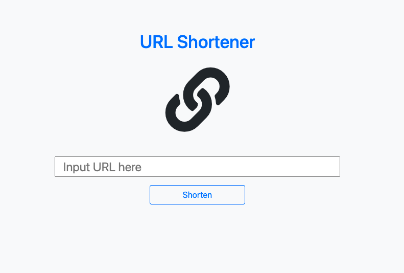
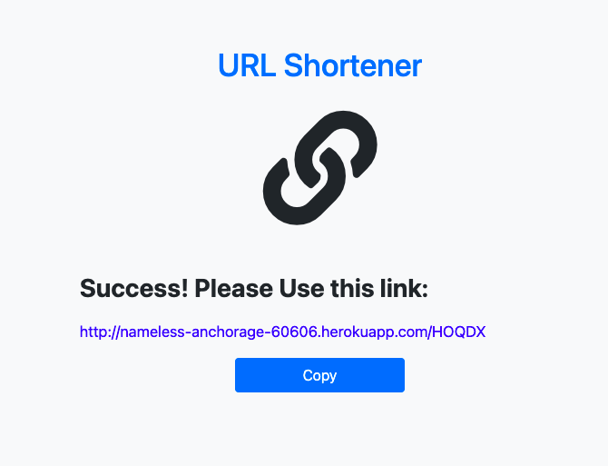

# URL Shortener
A simple URL Shortener website built with Node.js and Express

# Features
* Shorten URL by input
* Show alert of wrong format URL
* Copy shorten URL by copy button
* Redirect User to original URL by shorten URL
* Redirect User to original URL by click the shorten URL





# Getting Started
Clone repository to your local computer
```
$ git clone https://github.com/naluwan/URL-Shortener.git
```
Change to this project's directory
```
$ cd url_shortener
```
Install by npm
```
$ npm install
```
Seeds
```
$ npm run seed
```
Execute
```
$ npm run dev
```
Terminal show the message
```
Express is running on localhost:3000
```
Now you can browse the website on
```
http://localhost:3000
```
# Built With
* Node.js: 10.24.1
* Express: 4.17.1
* Express-Handlebars: 5.3.2
* Handlebars-Helpers: 0.10.0
* Body-Parser: 1.19.0
* Mongoose: 5.12.14
* Express-Validator: 6.12.0
 
# Author
NaLuWan 簡碩亨
Email: street.baller06@gmail.com
